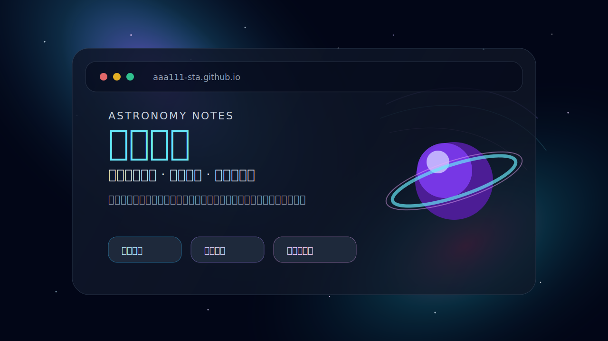

<div align="center">

# 🌌 星语宇宙

一个面向中文读者的天文科普知识站。  
用文章、观测笔记、图库和交互实验，把遥远的宇宙讲得更清楚一点。

[在线访问](https://aaa111-sta.github.io/) · [天文文章](https://aaa111-sta.github.io/posts/) · [星图笔记](https://aaa111-sta.github.io/notes/) · [宇宙实验室](https://aaa111-sta.github.io/lab/)



</div>

---

## 项目简介

**星语宇宙** 是一个基于 Astro 构建的静态网站，主题围绕天文科普、星空观测和宇宙知识整理。

它不是一个原样套用的模板站点，而是在 Astro 博客框架基础上做了中文化和视觉重构：

- 用中文组织首页、文章、笔记、标签和导航。
- 用深空蓝紫、星云渐变和动态宇宙背景建立视觉识别。
- 用专题文章讲解太阳系、黑洞、可观测宇宙等基础主题。
- 用“宇宙实验室”和“星空图库”承载更具探索感的内容入口。
- 用 GitHub Actions 自动构建并部署到 GitHub Pages。

在线站点：<https://aaa111-sta.github.io/>

## 网站内容

| 板块 | 说明 |
| --- | --- |
| 首页 | 展示站点定位、最新文章和星图笔记入口 |
| 天文文章 | 较完整的中文科普文章，例如太阳系、黑洞、宇宙尺度 |
| 星图笔记 | 更轻量的观测记录、流星雨提示和夜空知识 |
| 宇宙实验室 | 面向轨道、光谱、星系、流星雨等主题的探索页面 |
| 星空图库 | 用视觉素材呈现星空、宇航员、流星等主题氛围 |
| 标签页 | 按主题整理文章，便于后续扩展 |

## 设计方向

这个站点的视觉目标是“安静、深邃、适合阅读”，不是单纯堆叠科幻元素。

当前设计重点：

- **深空主色调**：以暗色背景、蓝紫渐变和星辰高光作为主要识别。
- **动态宇宙背景**：用轻量动画增强沉浸感，同时避免干扰正文阅读。
- **中文阅读优先**：导航、日期、文章结构和说明文字都面向中文读者。
- **静态优先部署**：构建产物是纯静态文件，适合 GitHub Pages 托管。

## 技术栈

- [Astro](https://astro.build/) 7
- TypeScript
- Tailwind CSS 4
- MD / MDX 内容集合
- Pagefind 静态搜索
- Satori 生成 Open Graph 图片
- GitHub Actions + GitHub Pages 自动部署

## 本地运行

本项目当前以 **npm** 作为部署工作流的包管理器。

```bash
npm install
npm run dev
```

常用命令：

| 命令 | 用途 |
| --- | --- |
| `npm run dev` | 启动本地开发服务器，默认端口 3000 |
| `npm run build` | 构建生产版本到 `dist/` |
| `npm run preview` | 本地预览构建后的站点 |
| `npm run check` | 运行 Astro 检查和 Biome 检查 |

## 内容编辑入口

主要内容文件位于：

```text
content/
├── posts/   # 长文章
├── notes/   # 短笔记
└── tags/    # 标签说明
```

站点配置位于：

```text
src/site.config.ts
```

常见页面入口：

```text
src/pages/index.astro      # 首页
src/pages/gallery.astro    # 星空图库
src/pages/lab.astro        # 宇宙实验室入口
src/pages/lab/             # 实验室子页面
```

## 部署方式

仓库推送到 `main` 分支后，GitHub Actions 会自动执行：

1. 安装依赖：`npm ci`
2. 构建站点：`npm run build`
3. 上传 `dist/`
4. 发布到 GitHub Pages

部署配置文件：

```text
.github/workflows/deploy.yml
```

当前线上地址：

```text
https://aaa111-sta.github.io/
```

## 截图预览

README 顶部的封面图是为本项目单独制作的视觉预览，用来表达站点的核心气质：深空背景、中文天文内容、文章与实验室并行的结构。

真实站点可以直接访问：

```text
https://aaa111-sta.github.io/
```

如果后续网站界面继续变化，可以把 `public/readme-preview.svg` 替换为新的站点截图或重新设计的项目封面。

## 内容路线图

| 阶段 | 主题 | 计划内容 | 状态 |
| --- | --- | --- | --- |
| Phase 1 | 基础科普 | 太阳系、黑洞、可观测宇宙、星系尺度等入门文章 | 已开始 |
| Phase 2 | 观测笔记 | 流星雨、月相、夜空目标、观测准备清单 | 已开始 |
| Phase 3 | 宇宙实验室 | 轨道、光谱、星系、流星雨等交互式解释页面 | 已搭框架 |
| Phase 4 | 星空图库 | 星空、宇航员、流星、深空主题图片与说明 | 已搭框架 |
| Phase 5 | 专题索引 | 星座、深空天体、宇宙学概念、常见问题索引 | 计划中 |
| Phase 6 | 阅读体验 | 移动端细节、图片加载、搜索覆盖范围、文章目录体验 | 计划中 |

近期优先级：

1. 补充 5–10 篇稳定的中文天文科普文章。
2. 为“宇宙实验室”每个子页面增加更完整的解释文字和图示。
3. 建立“观测日历”页面，整理适合普通读者关注的天象事件。
4. 把图库从氛围展示扩展为“图片 + 说明 + 相关知识点”的结构。

## 致谢

本项目基于 Astro 生态构建，并参考了 Astro Cactus 主题的工程结构。当前仓库已经围绕“中文天文科普站”进行了内容、视觉和部署方向的重构。
